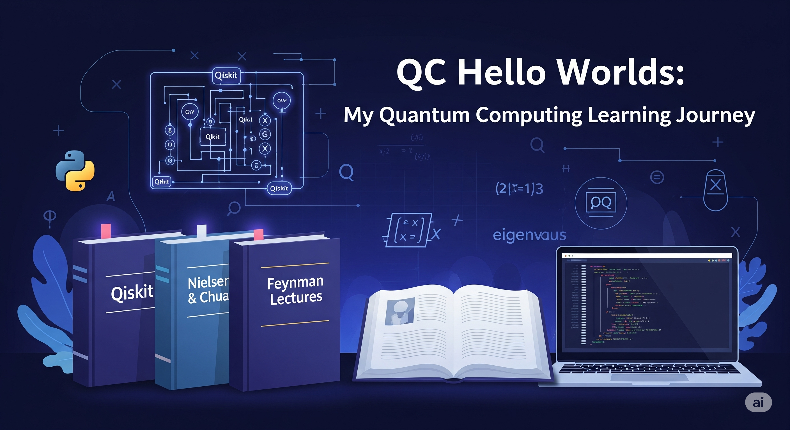

# QC Hello Worlds

My repo for quantum computing resources and simple practices. My goal is to get to a point where I can solve realistic problems. Not just to understand what quantum computing (QC) is at a high-level.

## Resources

As I learn QC, I will list out my resources here for the benefit of others. I will focus only on free resources or material that is likely easily available to most people. The ones that have a ✅ are the ones that I have finished myself.

### Prerequisite

Material to review before diving into the other resources.

1. ✅**Linear algebra**: Need to be comfortable with matrix algebra, determinant, trace, eigenvalue, etc. 3blue1brown [has a video series](https://www.3blue1brown.com/topics/linear-algebra) that I highly recommend.
2. ✅**Python**: There are countless resources to learn python. I'm not going to list them here. Get comfortable with it.

### Quantum Mechanics

The first step is to learn (or re-learn) the fundamentals of Quantum Mechanics.

3. **The Feynman Lectures on Physics, Vol. III**: A classic and insightful introduction to quantum mechanics by Richard Feynman. [Available online for free](https://www.feynmanlectures.caltech.edu/III_toc.html).
4. ✅**Susskind's "The Theoretical Minimum"**: A book and [lecture series](https://theoreticalminimum.com/courses) by Leonard Susskind that aims to provide the essential knowledge for modern physics. The fact that this is freely available is baffling to me.
   +  The [Quantum Mechanics course](https://theoreticalminimum.com/courses/quantum-mechanics/2012/winter) is a requirement. It's ~20 hours of video lectures.
   +  The rest are optional. I'm hooked and will likely continue.
5. ✅**Prompt Engineering**: I have put together [a prompt](prompts/physics_professor.md) (as a Gemini gem) so I can ask follow up questions whenever I need to. And also to have AI quiz me. Like as I'm watching Susskind lectures on topic X and there is something I don't understand, I have gemini teach that to me and then quiz me. Feel free to customize it based on your own background and goals. Right now it’s instructed to ask you for those each time.

### Quantum Computing

Resources that are specifically about teaching quantum computing (QC).

6. ✅[**QC for beginners** on coursera](https://www.coursera.org/specializations/packt-the-complete-quantum-computing-course-for-beginners): If you have access to Coursera via your school or work, then this is a good resource. It covers the prerequisites (linear algebra, QM, python) by itself. It does not get too deep into the math. You will see some Dirac notation for the circuits but you won’t see the proof.
7. [**QC course on Brilliant**](https://brilliant.org/courses/quantum-computing/): I haven’t done it myself. Its outline seems similar to the one above but it uses Q# (Microsoft’s language) instead of Qiskit (IBM’s language).
8. [**And more courses on Udemy**](https://www.udemy.com/topic/quantum-computing/).
9. ✅[**3Blue1Brown video on Groover’s algo**: [Part 1](https://www.3blue1brown.com/lessons/grover), [Part 2](https://www.3blue1brown.com/lessons/grover-clarification). Whatever you do, don’t skip this. It’ll give you a visual proof of Grover’s algorithms and also explain briefly what quantum computers could do in general.
10. If you want the proof for other famous quantum algorithms (like Shor’s), try the same prompt from item 5.
11. ✅[**QC Gate cheat sheet**](https://docs.google.com/document/d/e/2PACX-1vTMarZzqZdT2k_nZi8rFl7poeQINyIKG4N6wEgnfyegg7WW2nI2GP9TLL61AnQqHnkDpcspJT-9ONAS/pub): A short doc I prepared myself about all the QC gates and their definition.
12. [**Qiskit Textbook**](https://qiskit.org/textbook/preface.html): An excellent open-source textbook that teaches the concepts of quantum computing from the ground up, with interactive code examples using IBM's Qiskit.
13. **"Quantum Computation and Quantum Information" by Nielsen & Chuang**: Often called the "bible" of quantum computing, this is the standard graduate-level textbook. Google it and you may find free PDFs.
14. **Quantum Country**: An interactive, mnemonic-based introduction to quantum computing and quantum mechanics. A great starting point for conceptual understanding. [Read it here](https://quantum.country/qcvc). Co-authored by the same Michael Nielsen as above.
15. **[Quantum Computation video lecture from Umesh Vazirani**](https://www.youtube.com/watch?v=VPsl_5RQe1A&list=PLnhoxwUZN7-6hB2iWNhLrakuODLaxPTOG)

### New frontiers

Beyond learning QC fundamentals I’d like to learn about practical ways to use them in the near future. So I will dig into Quantum AI, Quantum Approximate Optimization Algorithm (QAOA), etc.

16. [**k-SAT paper**](https://dl.acm.org/doi/10.1145/3313276.3316359): I heard good things and need to read it.
17. ✅I had gemini compile [a comprehensive research on QAOA](https://docs.google.com/document/d/e/2PACX-1vSd7z9rS4XBRHQmrOw0_kQVcoeOYX8YADmTzWGbGhfKkbilnEHfFAe2GO7j36xnUqqhcth1Nc56rMcK/pub) from web. Reading it should bootstrasp you into the quantum aproximiation space.

### Further material

18. I found a similar [QC resource list on github](https://github.com/MonitSharma/Learn-Quantum-Computing-For-Free). It’s more exhaustive. If I find anything interesting there, I’ll cover it too.
